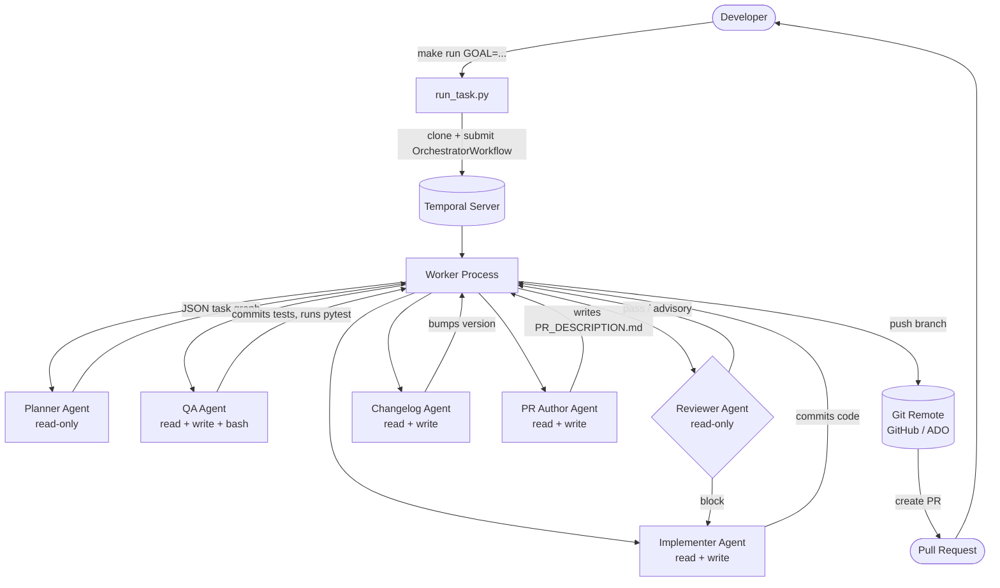
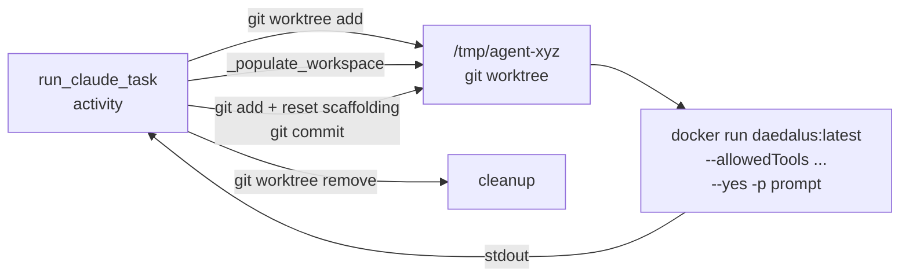
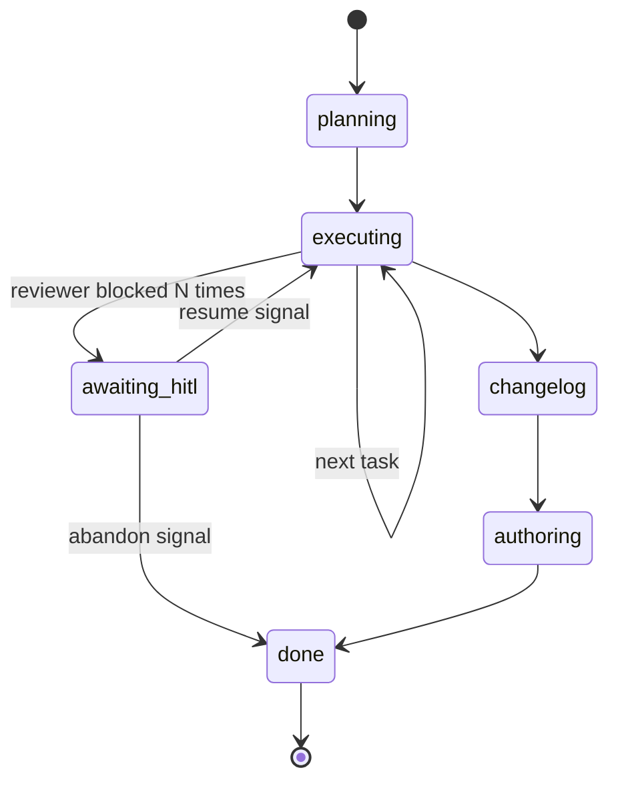
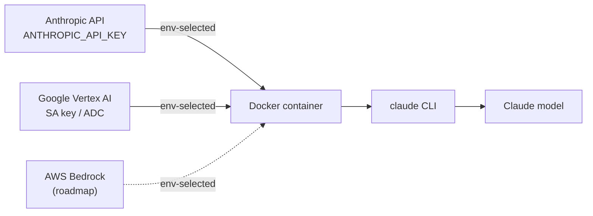

# Daedalus Architecture

## Pipeline overview

## Agent isolation

Each agent runs as an isolated Claude Code process inside Docker:

### What goes into the workspace

| File | Source | Committed? |
|---|---|---|
| All repo files | git worktree | Yes (if agent changes them) |
| `CLAUDE.md` | `agents/<type>.md` or `agents/default.md` | **No** - excluded |
| `_context.md` | workflow (goal + prior results) | **No** - excluded |
| `standards/*.md` | `agents/standards/` | **No** - excluded |
| `PR_DESCRIPTION.md` | pr_author agent | **No** - excluded |

## Workflow state machine

## Signals and queries

| Signal / Query | Direction | Purpose |
|---|---|---|
| `steer(text)` | → workflow | Inject guidance into next agent turn |
| `resume(decision)` | → workflow | Unblock HITL pause: `"resume"` or `"abandon"` |
| `status()` | ← workflow | Returns phase, current_task, blocked_reason, current_sha |

## LLM credential flow (pluggable backend)

The model backend is selected by environment; the container receives whatever credentials the chosen provider needs. The workflow and agent code are identical across backends.

